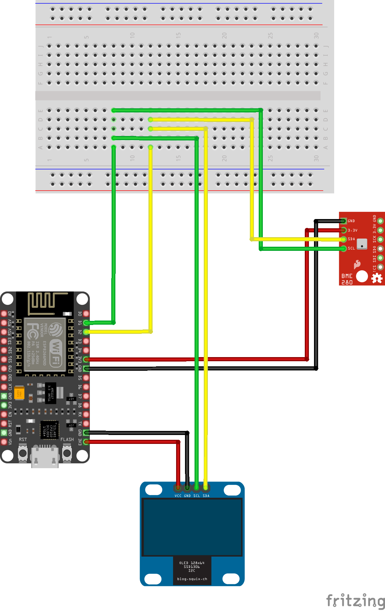
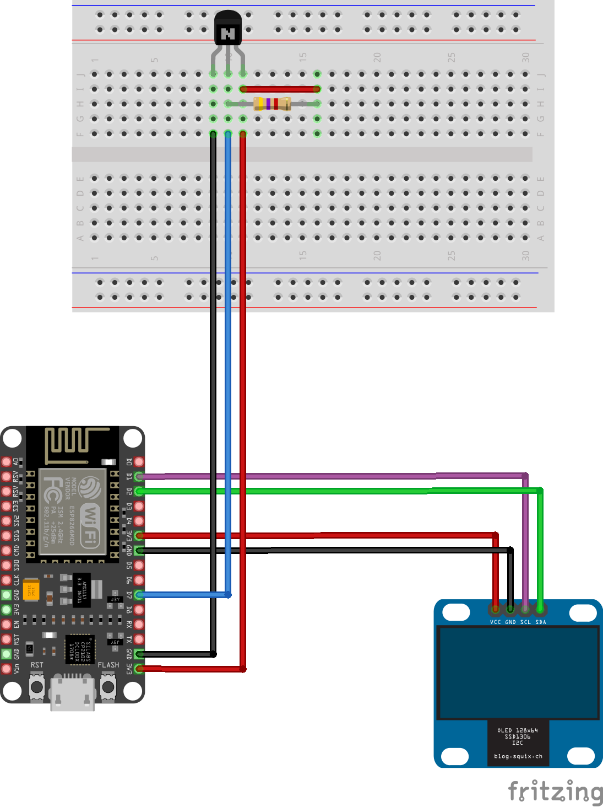

# Overview

This project implements a temperature/humidity sensor using simple components, and even integrates into your smart home. It is highly configurable, and components can also be swapped to your liking, in case you have different components lying around already.

The version I have built for myself is used for my spider enclosure, and I am using the Bosch BME280 sensor along with a NodeMCU microcontroller. 

Optionally, you can configure WiFi-credentials, in which case the sensor will enable NTP time synchronization, so you will be able to set a day/night time (without network access, Arduinos will be unable to know the time of day). In addition, in case you are running a MQTT broker in your network, you can configure the sensor to connect to it. In this case, it will periodically send messages to the MQTT broker containing the temperature/humidity reading. This makes it extremely easy to integrate into your Home Assistant or other smart home software.

This repository also contains .STL files so you can 3D-print a case matching the components I have used

# Shopping list

- Microcontroller, preferably [NodeMCU](https://www.amazon.de/AZDelivery-NodeMCU-ESP8266-ESP-12E-Development/dp/B06Y1LZLLY/ref=sr_1_3?__mk_de_DE=%C3%85M%C3%85%C5%BD%C3%95%C3%91&crid=1VMUXXP0OUAVQ&keywords=nodemcu%2Bamica&qid=1665129760&qu=eyJxc2MiOiIyLjU1IiwicXNhIjoiMi4wMyIsInFzcCI6IjEuNzcifQ%3D%3D&sprefix=nodemcu%2Bamica%2Caps%2C107&sr=8-3&th=1), 6.99€. Note that the case I am using is designed for a microcontroller with 48x26mm dimensions.
- Temperature sensor, BME280 or DS18B20, e.g. [BME280](https://www.amazon.de/AZDelivery-GY-BME280-Barometrischer-Temperatur-Luftfeuchtigkeit/dp/B07D8T4HP6/ref=sxin_15_ac_d_rm?__mk_de_DE=%C3%85M%C3%85%C5%BD%C3%95%C3%91&ac_md=2-2-Ym1lMjgwIGF6ZGVsaXZlcnk%3D-ac_d_rm_rm_rm&content-id=amzn1.sym.65c60da3-1aab-40d5-b2d2-9ea9132fdb5e%3Aamzn1.sym.65c60da3-1aab-40d5-b2d2-9ea9132fdb5e&crid=335USWXI6X61G&cv_ct_cx=bme280&keywords=bme280&pd_rd_i=B07D8T4HP6&pd_rd_r=399ec0a2-2a0b-4344-baeb-4094bcdbffeb&pd_rd_w=qXLO0&pd_rd_wg=zYXHI&pf_rd_p=65c60da3-1aab-40d5-b2d2-9ea9132fdb5e&pf_rd_r=4MAD5EF1PG3J38EJWJG7&psc=1&qid=1665129975&qu=eyJxc2MiOiI1LjY3IiwicXNhIjoiNS4zMiIsInFzcCI6IjUuMzgifQ%3D%3D&sprefix=bme280%2Caps%2C123&sr=1-3-e2b79f78-a3a0-4cac-b70d-2a5e4ae8e724), 17.99€. For the BME280 make sure you buy the I2C version
- OLED Display SSD1306, e.g. [OLED Display](https://www.ebay.de/itm/255283295122?mkcid=16&mkevt=1&mkrid=707-127634-2357-0&ssspo=kSLcqpXwSAK&sssrc=2349624&ssuid=p0UVLAOxThm&var=&widget_ver=artemis&media=WHATS_APP), 4.85€. The case is designed for a display with 26x26mm dimensions. Take care, as several different versions of this display are sold with slightly different dimensions
- Cables, screws
- Cable holder/mount for the sensor cable
- Might want to know how to solder

The case I am using for the BME280 sensor is this one: [Sensor case](https://www.thingiverse.com/thing:3809818#Print%20Settings).

# Wiring

Depending on the temperature sensor which is used, the wiring is different.

## BME280 wiring



## DS18B20 wiring



# Configuration

When downloading the repo, rename the contained `config_example.h` file to `config.h` before compiling. Make any necessary adjustments to the `config.h` file for your liking. WiFi/MQTT can be completely disabled. In this case, the temperature is only displayed on the display.

All lines starting with `//` will be ignored. So you enable a line by removing the `//` in front of it, and you disable a line by adding `//` in front of it.

## Select microcontroller

```
//#define USE_ESP32            // use THIS line when using Sparkfun Thing ESP32 / Firebeetle ESP32 / Weemos LOLIN 32 lite ...
#define USE_ESP8266          // use THIS line when using NodeMCU / Firebeetle ESP8266
//#define USE_UNO              // use THIS line when using Arduino Uno wifi
```

Select the correct microcontroller you are using. I recommend NodeMCU (`#define USE_ESP8266`). Depending on the board you chose, it might be that code adjustments are necessary, because e.g. EEPROM and WiFi implementations are different from controller to controller. I have tested and can confirm that NodeMCU works fine. 

## Sensor settings

```
#define USE_BOSCH_TEMP          // use THIS line when using BME280 temperature/humidity sensor
//#define USE_DALLAS_TEMP         // use THIS line when using DS18B20 temperature sensor

#define SENSOR_ADDRESS 0x76     // default for BME280, check data sheet

#define MEASURE_EVERY_SECONDS  120 * 1000      // measure every 120s
#define TEMP_SENSOR_PIN        13              // read pin for DS18B20 temperature sensor
                                               // unused if using BOSCH BME280 temperature sensor (will use I2C)
```

The first two lines again select the type of sensor you are using. You must chose one of the two.

When using the BOSCH sensor, `SENSOR_ADDRESS` must be enabled too. You can check the datasheet of the sensor you bought, but the value of `0x76` should be correct. 

When using the DS18B20 sensor, `SENSOR_ADDRESS` is unused. Instead, `TEMP_SENSOR_PIN` must be enabled, and define the pin where the data wire of the sensor is connected.

Finally, `MEASURE_EVERY_SECONDS` defines the interval in which temperature readings are taken. This is also the interval in which readings are published to MQTT.

## WiFi settings

```
#define WIFI_ENABLED

#define WIFI_PASS    "MY_WIFI_SSID"
#define WIFI_SSID    "MY_WIFI_PASSWORD"
#define WIFI_NAME    "terr_tempsensor"

#define MQTT_ID      "MY_CLIENT_ID"
#define MQTT_HOST    "MY_MQTT_HOSTNAME"
#define MQTT_PORT    1883

#define TOPIC_STATE    "ha/sensor/tempsensor/status"
#define TOPIC_CONTROL  "ha/sensor/tempsensor/control"

//#define NTP_HOSTNAME   "myNtpHostName"
```

If using WiFi, the first line must be enabled. In addition, the following three lines must be enabled an contain valid credentials for your WiFi network. When starting the sensor, the display will show a blinking WiFi-icon while connecting. When successfully connected, the WiFi-icon will stop to blink.

When using MQTT, set the hostname of the MQTT broker and the port in the following three lines, as well as a client id (just pick a name for your sensor).

The next two lines define the MQTT topics the sensor will use. The `TOPIC_STATE` will be the topic where temperature readings are published to, while `TOPIC_CONTROL` is a topic the sensor will subscribe to. You can send messages to the control topic in order to change the sensor configuration.

The last line is optional. In case you are running a NTP server in your network, set its hostname here. Otherwise the sensor will try to use public NTP servers. In this case, internet access is needed.

When the sensor starts for the first time, a random device ID is generated and stored in the EEPROM of the microcontroller. This helps to identify your sensor, and it is added to the topic names you defined in `config.h`. This means in the example above, that when for example, the device ID is `0x43ff863d`, the state topic will *actually* be `ha/sensor/tempsensor/status/0x43ff863d`, and the control topic will *actually* be `ha/sensor/tempsensor/control/0x43ff863d`.

### MQTT control messages

Two different commands can be sent to the sensor:

1) Set night mode
   Sets the time slot where the display should be turned off
2) Display
   Enables/disables the display
   
This allows you to have the screen automatically go dark in the night, or to triggere display on/off from your home automation.

#### Set night mode

Send one of the following messages to the control topic:

```
mosquitto_pub -h [MQTT HOSTNAME HERE] -t 'ha/sensor/tempsensor/control/0x43ff863d' -m '{"command":"setNightMode","off":true}' 
mosquitto_pub -h [MQTT HOSTNAME HERE] -t 'ha/sensor/tempsensor/control/0x43ff863d' -m '{"command":"setNightMode","from":"07:15","to":"22:50"}' 
```

The first message completely disables night mode. This means the display will be on 24h hours a day.
The second message lets the display go dark after 22:50 and enable the display again at 7:15 in the morning.

Sending this command overwrites the hardcoded settings from `config.h` (see chapter **Display settings**). Settings here will be saved to the EEPROM and restored after restart.

#### Display

Send one of the following messages to the control topic:

```
mosquitto_pub -h [MQTT HOSTNAME HERE] -t 'ha/sensor/tempsensor/control/0x43ff863d' -m '{"command":"display","off":true}' 
mosquitto_pub -h [MQTT HOSTNAME HERE] -t 'ha/sensor/tempsensor/control/0x43ff863d' -m '{"command":"display","off":false}' 
```

The first message turns on the display, the second one turns it off.

## Display settings

```
#define SCREEN_WIDTH           128      // OLED display width, in pixels
#define SCREEN_HEIGHT          64       // OLED display height, in pixels
#define OLED_RESET             -1       // Reset pin # (or -1 if sharing Arduino reset pin)
#define SCREEN_ADDRESS         0x3C     //< See datasheet for Address

#define DISPLAY_START          "07:15"  // turn on display
#define DISPLAY_END            "22:00"  // turn off display
```

The first two lines define the display dimensions, and the third line defines the reset pin. Should be left at -1 to use the arduino reset button. The screen address can be taken from the display datasheet, but `0x3C` will most likely work.

The last two lines define the time during which the display is enabled. Outside of this timeframe the display will go dark. If you disable both lines, the display will be on 24h a day.
The display can also be turned on/off via MQTT commands, see chapter **MQTT control messages**.
